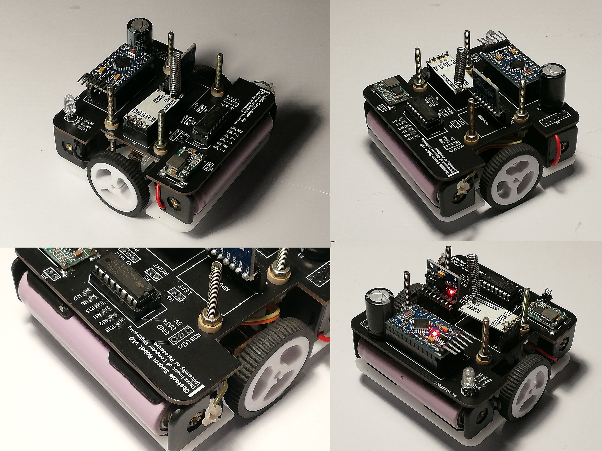

## Obstacle Bot Intro

### Hardware Specifications

- Microcontroller: Arduino Pro Mini (16 MHz, 3.3V)
- Power Source: 2 x Li-ion batteries
- Motiopn
  - Motors: N20 Motors (180 rpm)
  - Driver: L293D
  - Wheels: D-hole Rubber Wheel (32x7mm/3mm)
- Communication: HC-11 Wireless Serial Port
- Sensors
  - MPU-6050
- Indicators
  - RGB LED x 1
  - NeoPixel LED x 18

### More Info

- [Project Page - Obstacle Bots for Swarm Robots](https://cepdnaclk.github.io/e16-3yp-obstacle-bots-for-swarm-robots/)
- [GitHub Repository](https://github.com/Pera-Swarm/e16-obstacle-bots-for-swarm-robots)
