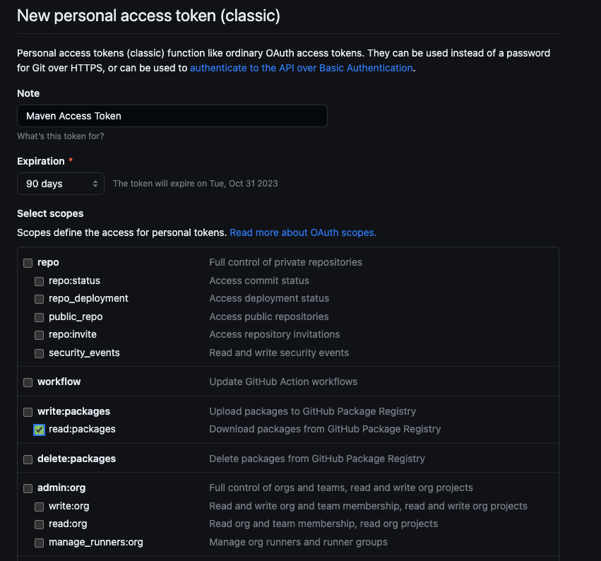

## Setup Guide - Java Robot

This will guide you to set up the Java Robot implementation of the Pera-Swarm virtual robots, by importing necessary dependencies, doing the configurations, and implementing your own first virtual robot instance.

### Getting started

If you are interested in only the robot functionalities and applications, not the core functionalities, you can start with the *pre-build* Java Library of the Virtual Robot library, and write your Virtual Robots.

### Environment Setup

- You need to fork and/or clone the repository, [Pera-Swarm/java-robot](https://github.com/Pera-Swarm/java-robot).

- Create a file named `mqtt.properties` in the path, `./src/resources/config/` as follows, and provide your MQTT broker's configurations. You can select any channel, as same as your simulation server runs on.

```xml
server=127.0.0.1
port=1883
username=user
password=pass
channel="v1"
```

- Next, need to obtain a GitHub *Personal Access Token* with the scope of `read:packages`, by following [this](https://github.com/settings/tokens/new) URL. Create it with a preferable expiration time and a Note. You need to copy this and save it somewhere to be used in the next step.



- As the next step, create a file named `settings.xml` in the root directory of the repository, by copying `settings.sample.xml`.

- Update **{GITHUB_USERNAME}** with your GitHub username and **{GITHUB_TOKEN}** with the Personal Access Token you obtained in the previous step.

```xml
<server>
    <id>github</id>
    <username>{GITHUB_USERNAME}</username>
    <password>{GITHUB_TOKEN}</password>
</server>
```

:::warning
Please note that this **settings.xml** file should not be committed into the git history, since it contains a secret value.
:::

- Next, run the following command to run the `mvn install`. It will download the necessary dependencies from *Maven Central Repository* and *GitHub Package Repository*.

```bash
mvn -s ./settings.xml -B install --file pom.xml
```

#### Run using IDE

- You can open the `src/main/java/swarm/App.java` file and run it using the **Run** or **Debug** option in the IDE to initiate the running of the implementation.

- If you are using VSCode IDE, you can select the **Run and Debug** tool, and start using 'Run a Swarm'.

#### Run using Command Line

- Compile the packages and assembly with all the dependencies, using `mvn compile assembly:single`

```bash
mvn clean compile assembly:single -s settings.xml
```

- Run the code implementation using `java -jar [jar_file_path]`

```bash
java -jar target/java-robot-node-1.0-SNAPSHOT-jar-with-dependencies.jar
```

### Additional Readings

- [Maven - Environment Setup](https://www.tutorialspoint.com/maven/maven_environment_setup.htm)
