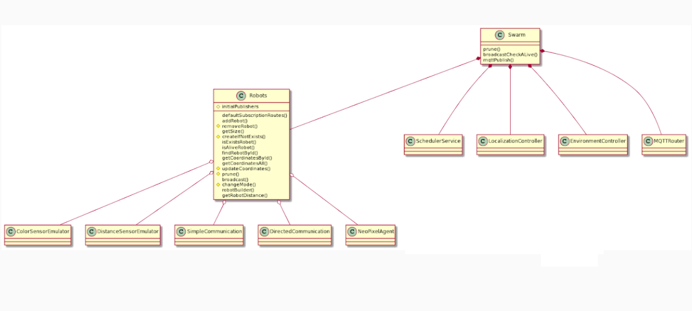

## Mixed Reality Simulator

### System Requirements

Please install node dependencies as follows. Make sure you have Node.js and npm installed.

```bash
npm install
```

| It is recommended to use Node 16 or newer version

### Environment Variables

Please copy the _sample.env_ file and rename into _.env_ and complete the configurations for HTTP and MQTT

```bash
MQTT_HOST=mqtt://localhost
MQTT_USER=user
MQTT_PASS=password
MQTT_CLIENT=mqtt_server
MQTT_CHANNEL=v1

ARENA_CONFIG="./app/config/arena/{arena_config}.json"

LOG_LEVEL='info'
```

### Run/Deployment

#### Local Deployment

```bash
# Dev Server with live reload
npm run dev

# Production ready build
npm run start
```

#### Production Deployment

```bash
# Install PM2 globally (if not yet)
sudo npm i -g pm2

# Start the server (give a proper server name)
pm2 start app/index.js --name {server_name}

# Generate and register a systemd unit for PM2
# This command above prints another command with sudo, and copy/paste that into CLI
pm2 startup systemd

# Persist the current PM2 process list
pm2 save

# Restart the server
pm2 restart {server_name}

# Stop the server
pm2 stop {server_name}
```

### Architecture


