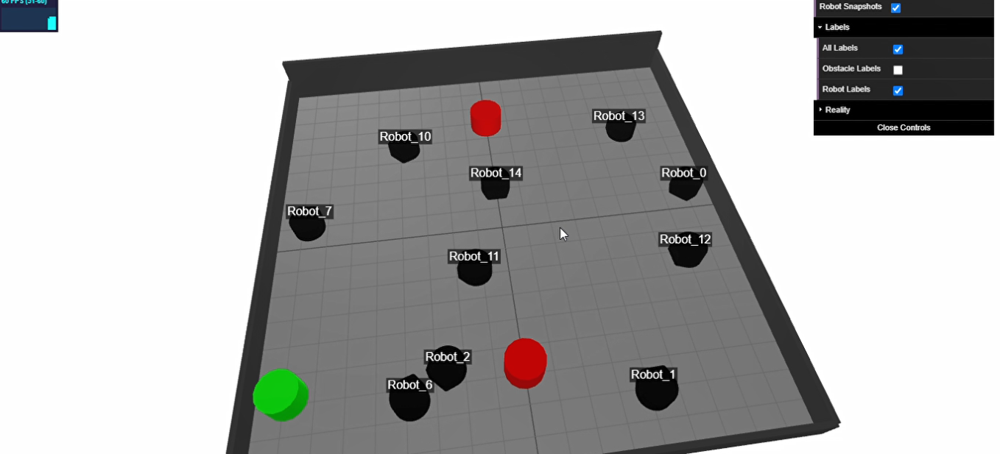

Visualizers
==========

.. image:: https://github.com/Pera-Swarm/visualizer/workflows/Webpack%20CI/badge.svg

Visualizers are a web-based tools that can be used to observe the robots in both repositories in a Virtual 3D environment.

.. toctree::
   :maxdepth: 1
   :glob:

   01_remote-access-guide.md
   02_local-setup-guide.md

Sample

